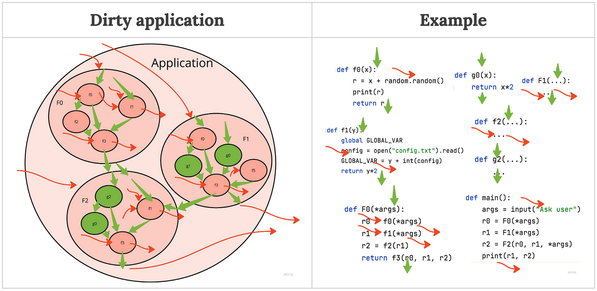

### Giới thiệu

Trong buổi nói chuyện này, chúng ta sẽ cùng tìm hiểu về khái niệm **Side Effect (Tác dụng phụ)** trong lập trình, đặc biệt là trong Lập trình Hàm (*Functional Programming*). Side effect là một vấn đề phổ biến nhưng thường bị bỏ qua, có thể ảnh hưởng lớn đến khả năng bảo trì và debug của mã nguồn.



### Side Effect là gì?

**Side Effect** là bất kỳ tác động nào của một hàm vượt ra ngoài việc trả về giá trị của nó. Điều này có thể bao gồm:
- Thay đổi trạng thái toàn cục hoặc trạng thái bên ngoài.
- Thực hiện các thao tác Input/Output (IO).
- Làm thay đổi hành vi của các hàm hoặc hệ thống khác.

#### Đặc điểm của hàm không có Side Effect:
- Chỉ thực hiện tính toán và trả về kết quả.
- Không làm thay đổi trạng thái bên ngoài hoặc tương tác với môi trường bên ngoài.

Ngược lại, hàm có Side Effect:
- Thay đổi biến toàn cục hoặc trạng thái bên ngoài.
- Thực hiện IO như in ra màn hình, ghi dữ liệu vào tệp.

### Hàm Thuần Khiết (*Pure Function*)

Một **hàm thuần khiết** thỏa mãn hai điều kiện:
1. Giá trị trả về chỉ phụ thuộc vào tham số đầu vào.
2. Không có bất kỳ tác dụng phụ nào.

#### Ví dụ về hàm thuần khiết:
```python
def cong(a, b):
    return a + b
```

### Tại sao cần tránh Side Effect?

Trong lập trình hàm, việc tránh Side Effect mang lại nhiều lợi ích:
1. **Dễ debug**: Hàm không có Side Effect dễ dự đoán và kiểm tra hơn.
2. **Tái sử dụng mã**: Hàm thuần khiết có thể được sử dụng ở nhiều nơi mà không lo ảnh hưởng ngoài ý muốn.
3. **Hỗ trợ tính bất biến**: Dữ liệu không bị thay đổi một cách ngẫu nhiên.
4. **Tối ưu hóa dễ dàng**: Trình biên dịch và runtime có thể tối ưu hóa hiệu quả hơn.

### Khi nào cần Side Effect?

Mặc dù việc tránh Side Effect là lý tưởng, nhưng trong thực tế, chúng ta không thể loại bỏ hoàn toàn. Các trường hợp cần Side Effect bao gồm:
- **Tương tác với hệ thống bên ngoài**: Ví dụ, ghi dữ liệu vào tệp, giao tiếp với cơ sở dữ liệu hoặc API.
- **Thay đổi trạng thái có kiểm soát**: Một số tác vụ yêu cầu cập nhật trạng thái, nhưng cần thực hiện cẩn thận.

### Kết luận

Side Effect, dù không mong muốn trong lập trình hàm, vẫn cần thiết trong một số trường hợp. Việc hiểu rõ khái niệm này và áp dụng các nguyên tắc để quản lý hiệu quả sẽ giúp mã nguồn trở nên rõ ràng, dễ bảo trì và ít lỗi hơn. 

Cảm ơn các bạn đã đọc. Hi vọng bài nói này sẽ giúp các bạn hiểu rõ hơn về Side Effect và cách xử lý chúng. Hẹn gặp lại trong các bài tiếp theo!


