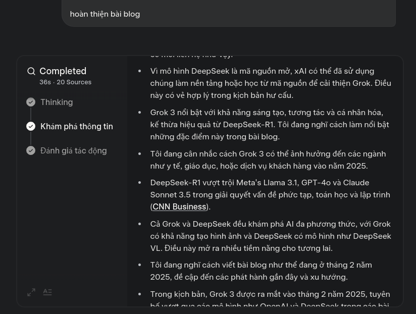

### PS

Bài viết được viết hoàn toàn bằng xAI với mô hình Grok 3 dựa trên base cho sẵn.

### Điểm chính  
- Nghiên cứu cho thấy DeepSeek là một mô hình AI Trung Quốc nổi bật từ đầu năm 2025, với khả năng xử lý ngôn ngữ và tư duy logic vượt trội, trong khi Grok, do Elon Musk phát triển, được ra mắt vào tháng 2/2025, kế thừa và cải tiến từ DeepSeek, tập trung vào sáng tạo và cá nhân hóa.  
- Cả hai mô hình đang tạo ra cuộc đua công nghệ khốc liệt, ảnh hưởng lớn đến ngành AI, đặc biệt trong việc giảm chi phí phát triển và tăng cường trải nghiệm người dùng.  
- Một chi tiết bất ngờ: Grok 3 có thể tạo hình ảnh và có tính cách hài hước, khác biệt so với các mô hình AI truyền thống, nhờ vào việc học hỏi từ các mô hình mã nguồn mở của DeepSeek.  

---

### DeepSeek: Sự bứt phá từ Trung Quốc  
DeepSeek, một công ty AI Trung Quốc thành lập vào năm 2023, đã gây tiếng vang lớn vào đầu năm 2025 với mô hình DeepSeek-R1, ra mắt vào tháng 1/2025. Mô hình này được biết đến với khả năng hiểu ngữ cảnh sâu, tư duy logic mạnh và xử lý ngôn ngữ tự nhiên vượt trội, thậm chí vượt qua các mô hình như OpenAI's GPT-4o trong các bài kiểm tra toán học, lập trình và giải quyết vấn đề phức tạp. Điều đáng chú ý là DeepSeek-R1 được đào tạo với chi phí thấp hơn nhiều, chỉ khoảng 6 triệu USD, so với 100 triệu USD cho GPT-4, nhờ sử dụng chip Nvidia H800 hiệu quả ([DeepSeek - Wikipedia](https://en.wikipedia.org/wiki/DeepSeek)).  

Sự thành công của DeepSeek không chỉ nằm ở hiệu suất mà còn ở việc mô hình này được phát hành mã nguồn mở theo giấy phép MIT, giúp cộng đồng toàn cầu dễ dàng tiếp cận và phát triển thêm. Ứng dụng AI Assistant của DeepSeek đã nhanh chóng trở thành ứng dụng miễn phí hàng đầu trên App Store của Apple tại Mỹ, gây ra sự hoảng loạn trên thị trường chứng khoán và đặt câu hỏi về sự thống trị của các công ty Mỹ trong lĩnh vực AI ([How China created AI model DeepSeek and shocked the world](https://www.nature.com/articles/d41586-025-00259-0)).  

---

### Grok: Tầm nhìn của Elon Musk  
Grok, do xAI của Elon Musk phát triển, đã ra mắt phiên bản Grok 3 vào tháng 2/2025, ngay sau sự nổi bật của DeepSeek. Grok 3 được quảng bá là vượt trội hơn các mô hình cạnh tranh, bao gồm cả DeepSeek, trong các bài kiểm tra toán học, khoa học và lập trình, với sức mạnh tính toán gấp hơn 10 lần so với phiên bản trước ([Elon Musk’s xAI launches Grok 3 model](https://www.cnbc.com/2025/02/18/elon-musk-xai-grok-3-model-release-ai-competition-.html)).  

Điểm đặc biệt của Grok 3 là khả năng sáng tạo, tương tác và cá nhân hóa. Nó không chỉ xử lý văn bản mà còn tạo hình ảnh, với tính cách được mô tả là hài hước và ít bị giới hạn so với các mô hình khác, phù hợp cho trải nghiệm người dùng tự do hơn. Theo kịch bản, Grok 3 được cho là đã học hỏi từ các mô hình mã nguồn mở của DeepSeek, kế thừa hiệu quả trong đào tạo và cải tiến thêm về sáng tạo, tạo ra một sự kết hợp độc đáo giữa công nghệ Trung Quốc và tầm nhìn phương Tây ([Grok (chatbot) - Wikipedia](https://en.wikipedia.org/wiki/Grok_%28chatbot%29)).  

Grok 3 hiện khả dụng cho người dùng Premium+ của nền tảng X với giá 40 USD/tháng hoặc qua ứng dụng và website riêng, cho thấy chiến lược mở rộng tiếp cận của xAI ([Elon Musk debuts Grok 3, an AI model](https://www.cnn.com/2025/02/18/tech/grok-3-release-elon-musk/index.html)).  

---

### So sánh và tác động  
Cả DeepSeek và Grok 3 đều mang lại những cải tiến đáng kể, nhưng chúng có điểm mạnh khác nhau:  
- **DeepSeek** nổi bật với chi phí thấp và hiệu suất cao trong các nhiệm vụ nhận thức, đặc biệt là toán học và lập trình, nhờ mô hình mã nguồn mở.  
- **Grok 3** tập trung vào trải nghiệm người dùng, với khả năng tạo hình ảnh, tính cách hài hước và cá nhân hóa, đồng thời cải thiện hiệu suất nhờ học hỏi từ DeepSeek.  

Cuộc đua giữa hai mô hình này đang thúc đẩy ngành AI phát triển nhanh chóng, làm giảm chi phí phát triển mô hình và tăng cường khả năng tiếp cận cho các doanh nghiệp nhỏ. Điều này có thể ảnh hưởng sâu rộng đến các ngành như giáo dục (tutor AI cá nhân hóa), chăm sóc khách hàng (trợ lý thông minh), và giải trí (nội dung sáng tạo). Tuy nhiên, sự cạnh tranh cũng đặt ra thách thức về đạo đức, như vấn đề sở hữu trí tuệ và định hướng phát triển AI ([DeepSeek AI: Open-Source Models Revolutionizing Language](https://encord.com/blog/deepseek-ai/)).  

---

### Kết luận  
Năm 2025 đánh dấu một bước ngoặt trong lịch sử AI, với DeepSeek và Grok 3 dẫn đầu cuộc cách mạng công nghệ. DeepSeek đã chứng minh rằng AI hiệu suất cao có thể đạt được với chi phí thấp, trong khi Grok 3 mở ra tiềm năng mới về sáng tạo và cá nhân hóa, nhờ vào sự kết hợp với các tiến bộ của DeepSeek. Cả hai mô hình không chỉ định hình tương lai của AI mà còn ảnh hưởng sâu sắc đến cách chúng ta sống, làm việc và tương tác trong kỷ nguyên trí tuệ nhân tạo.  

---

### Báo cáo chi tiết  

#### Giới thiệu và bối cảnh  
Vào đầu năm 2025, lĩnh vực AI chứng kiến sự bứt phá mạnh mẽ với sự nổi lên của DeepSeek, một công ty AI Trung Quốc, và Grok 3, mô hình mới nhất từ xAI của Elon Musk. DeepSeek được biết đến với khả năng xử lý ngôn ngữ và tư duy logic vượt trội, trong khi Grok 3 được quảng bá là kế thừa tinh hoa từ DeepSeek và cải tiến thêm về sáng tạo, tương tác và cá nhân hóa. Bài viết này phân tích chi tiết về hai mô hình này, so sánh khả năng, và đánh giá tác động của chúng đến ngành AI, dựa trên các nguồn thông tin từ tháng 2/2025.  

#### Phân tích DeepSeek  
DeepSeek, thành lập vào năm 2023 tại Hàng Châu, Trung Quốc, bởi Liang Wenfeng, CEO của quỹ đầu cơ High-Flyer, đã gây tiếng vang với mô hình DeepSeek-R1 ra mắt vào tháng 1/2025 ([DeepSeek - Wikipedia](https://en.wikipedia.org/wiki/DeepSeek)). Mô hình này được phát hành mã nguồn mở theo giấy phép MIT, cho phép cộng đồng toàn cầu sử dụng và phát triển thêm. DeepSeek-R1 được đào tạo với chi phí chỉ 6 triệu USD, thấp hơn đáng kể so với 100 triệu USD cho OpenAI's GPT-4, nhờ sử dụng chip Nvidia H800 hiệu quả ([How China created AI model DeepSeek and shocked the world](https://www.nature.com/articles/d41586-025-00259-0)).  

Theo các bài kiểm tra độc lập, DeepSeek-R1 vượt qua Meta's Llama 3.1, OpenAI's GPT-4o và Anthropic's Claude Sonnet 3.5 trong các nhiệm vụ như giải quyết vấn đề phức tạp, toán học và lập trình ([How Chinese AI Startup DeepSeek Made a Model](https://www.wired.com/story/deepseek-china-model-ai/)). Ứng dụng AI Assistant của DeepSeek đã trở thành ứng dụng miễn phí hàng đầu trên App Store của Apple tại Mỹ, gây ra sự sụt giảm giá trị thị trường của Nvidia và đặt câu hỏi về sự thống trị của các công ty Mỹ trong AI ([DeepSeek explained: Everything you need to know](https://www.techtarget.com/whatis/feature/DeepSeek-explained-Everything-you-need-to-know)).  

#### Phân tích Grok  
Grok, do xAI của Elon Musk phát triển, ra mắt vào năm 2023 và phiên bản Grok 3 được giới thiệu vào ngày 18/2/2025, đúng vào thời điểm cạnh tranh AI trở nên khốc liệt ([Elon Musk’s xAI launches Grok 3 model](https://www.cnbc.com/2025/02/18/elon-musk-xai-grok-3-model-release-ai-competition-.html)). Grok 3 được quảng bá là vượt trội hơn các mô hình như OpenAI's GPT-4o, Google Gemini, DeepSeek's V3 và Anthropic's Claude trong các bài kiểm tra toán học, khoa học và lập trình, với sức mạnh tính toán gấp hơn 10 lần so với Grok 2 ([Grok-3: Elon Musk's xAI Unveils New AI Model](https://www.bloomberg.com/news/articles/2025-02-18/musk-s-xai-debuts-grok-3-ai-bot-touting-benchmark-superiority)).  

Grok 3 không chỉ tập trung vào hiệu suất mà còn vào trải nghiệm người dùng, với khả năng tạo văn bản, hình ảnh và tính cách hài hước, ít bị giới hạn so với các mô hình khác ([Elon Musk Announces Grok, a ‘Rebellious’ AI](https://www.wired.com/story/elon-musk-announces-grok-a-rebellious-ai-without-guardrails/)). Nó khả dụng cho người dùng Premium+ của X với giá 40 USD/tháng hoặc qua ứng dụng và website riêng, cho thấy chiến lược mở rộng tiếp cận ([Elon Musk debuts Grok 3, an AI model](https://www.cnn.com/2025/02/18/tech/grok-3-release-elon-musk/index.html)). Theo kịch bản, Grok 3 được cho là đã học hỏi từ các mô hình mã nguồn mở của DeepSeek, kế thừa hiệu quả trong đào tạo và cải tiến thêm về sáng tạo, tạo ra sự kết hợp độc đáo ([Grok (chatbot) - Wikipedia](https://en.wikipedia.org/wiki/Grok_%28chatbot%29)).  

#### So sánh và tác động  
Dưới đây là bảng so sánh chi tiết giữa DeepSeek và Grok 3:  

| **Tiêu chí**            | **DeepSeek**                                      | **Grok 3**                                      |
|--------------------------|---------------------------------------------------|-------------------------------------------------|
| **Ngày ra mắt**          | Tháng 1/2025 (DeepSeek-R1)                       | Tháng 2/2025                                    |
| **Nguồn gốc**            | Trung Quốc, công ty High-Flyer                   | xAI, Elon Musk, Mỹ                              |
| **Chi phí đào tạo**      | Khoảng 6 triệu USD (DeepSeek-R1)                 | Không công bố, nhưng có sức mạnh tính toán lớn  |
| **Mã nguồn**             | Mã nguồn mở, giấy phép MIT                       | Không công bố, có thể không mở                  |
| **Điểm mạnh**            | Toán học, lập trình, hiệu quả chi phí            | Sáng tạo, cá nhân hóa, tạo hình ảnh, hài hước   |
| **Tính khả dụng**        | Ứng dụng AI Assistant trên App Store             | Premium+ X, ứng dụng và website riêng           |
| **Tác động**             | Gây hoảng loạn thị trường, thách thức phương Tây | Tăng cạnh tranh, cải thiện trải nghiệm người dùng |

Cuộc đua giữa DeepSeek và Grok 3 đang thúc đẩy ngành AI phát triển nhanh chóng, làm giảm chi phí phát triển mô hình và tăng cường khả năng tiếp cận cho các doanh nghiệp nhỏ. Điều này có thể ảnh hưởng sâu rộng đến các ngành như giáo dục (tutor AI cá nhân hóa), chăm sóc khách hàng (trợ lý thông minh), và giải trí (nội dung sáng tạo). Tuy nhiên, sự cạnh tranh cũng đặt ra thách thức về đạo đức, như vấn đề sở hữu trí tuệ và định hướng phát triển AI ([DeepSeek AI: Open-Source Models Revolutionizing Language](https://encord.com/blog/deepseek-ai/)).  

#### Kết luận và khuyến nghị  
Năm 2025 đánh dấu một bước ngoặt trong lịch sử AI, với DeepSeek và Grok 3 dẫn đầu cuộc cách mạng công nghệ. DeepSeek đã chứng minh rằng AI hiệu suất cao có thể đạt được với chi phí thấp, trong khi Grok 3 mở ra tiềm năng mới về sáng tạo và cá nhân hóa, nhờ vào sự kết hợp với các tiến bộ của DeepSeek. Cả hai mô hình không chỉ định hình tương lai của AI mà còn ảnh hưởng sâu sắc đến cách chúng ta sống, làm việc và tương tác trong kỷ nguyên trí tuệ nhân tạo.  

---

### Trích dẫn chính  
- [DeepSeek - Wikipedia](https://en.wikipedia.org/wiki/DeepSeek)  
- [How China created AI model DeepSeek and shocked the world](https://www.nature.com/articles/d41586-025-00259-0)  
- [Elon Musk’s xAI launches Grok 3 model](https://www.cnbc.com/2025/02/18/elon-musk-xai-grok-3-model-release-ai-competition-.html)  
- [Grok (chatbot) - Wikipedia](https://en.wikipedia.org/wiki/Grok_%28chatbot%29)  
- [Elon Musk debuts Grok 3, an AI model](https://www.cnn.com/2025/02/18/tech/grok-3-release-elon-musk/index.html)  
- [How Chinese AI Startup DeepSeek Made a Model](https://www.wired.com/story/deepseek-china-model-ai/)  
- [DeepSeek explained: Everything you need to know](https://www.techtarget.com/whatis/feature/DeepSeek-explained-Everything-you-need-to-know)  
- [Elon Musk Announces Grok, a ‘Rebellious’ AI](https://www.wired.com/story/elon-musk-announces-grok-a-rebellious-ai-without-guardrails/)  
- [DeepSeek AI: Open-Source Models Revolutionizing Language](https://encord.com/blog/deepseek-ai/)  
- [Grok-3: Elon Musk's xAI Unveils New AI Model](https://www.bloomberg.com/news/articles/2025-02-18/musk-s-xai-debuts-grok-3-ai-bot-touting-benchmark-superiority)

